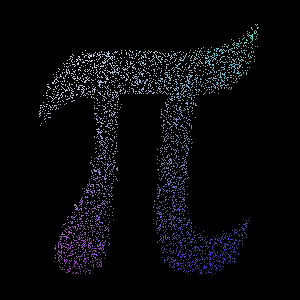
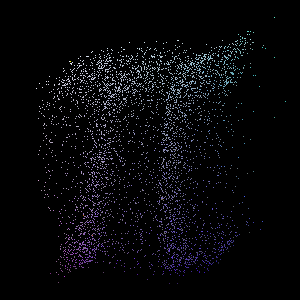
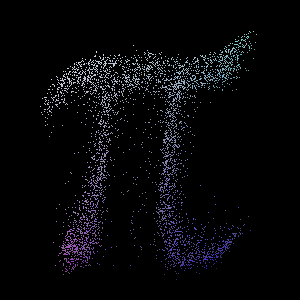

## Generative Pi
This repo is a fun exercise for generative model. Specifically, given an image of Pi with size HxW, we will build a generative model for it. 

### Dataset
The data is stored in `data`, consisting of files in the following:
1. `sparse_pi_colored.jpg`: the main data, that is the Pi image
2. `sparse_pi.jpg`: similar to no 1, but in black-white color
3. `pi_xs.npy`: storing the `x` axes of the foreground pixels
3. `pi_ys.npy`: storing the `y` axes of the foreground pixels

### Installation and setup
In your favorite Python environment, please install the required libraries by  `pip install -r requirements.txt`

### How to train
To run train the generative model, please run the script below:
```
python main.py --is_train=1 --output_dir=output
```

### How to test
To run test the pre-trained generative model, please run the script below:
```
python main.py --is_train=0 --output_dir=output --model_store_path=model/store
```
This repo already provides a pre-trained model in `model/store`

### The method at a glance
This repo uses VAE (variational autoencoders) to model the Pi Image. The specifications are:
1. Problem formulation: since most of the given image pixels are black, therefore, we will learn to generate the foreground only. In the given image, the sizes are 300x300 image, i.e., consisting of 90,000 pixels, while only 5000 pixels are associated with foreground.
2. `input`: Set of data with sizes of 5000x5, where 5000 represents the number of data points and 5 is for x,y pixel coordinates for the first two values, and the rgb data for the remaining.
3. `output`: The model learns the distribution of foregroud data specified in the `input` above. The model output shape is `[BS, 5]`, where `BS` denotes the batch size and 5 is for xyrgb data.

### Results
The original image is shown below.<br>


After training is competed, see the generated images in the path you specified in `args.output_dir`. Image below is generated by sampling latent data from random Gaussian noise.<br>


While, image below is generated by sampling new image utilizing the learned latent mean and variance by the VAE encoder. Note that this generation needs the original input image, and produces better results that directly sampling from random Gaussian noise.<br>


These generated images can also be obtained by running the [testing script](#how-to-test)

### Comparing the quality of generation resuts
As qualitative comparation can be directly seen via the presented image aboves, we can also do qualtitative comparisons. One of strighforward way to do so is by using KL-divergence to measure the alignmemnt of generated image distribution compared to the original image. This comparison is implemented in `utils.py` as `compare_dist` function, and is imployed to evaluate to generated results when running the [testing script](#how-to-test). After running it, in addition to the generated images, we will aslo get the KL-divergence output, such as below.
```
************** Distribution info via KL divergence **************
1. Original data vs. gen. data (rand-noise)    : 1.1343
2. Original data vs. gen. data (learned-latent): 1.0813
3. Original data vs. random data               : 3.485
4. Original data vs. itself (as ref.)          : 0.0
```
KL-divergence ranges from 0 to infinity, where 0 means two distributions are perfectly aligned, while higher value means less aligned. From the numbers above, we can see that the generated data (see no 1 & 2) are notably more aligned w.r.t the original data, compared to the random generated data (see no 3). Seeing more details, the generated data using learned-latent variables, namely using learned mean and var from the VAE encoder, has better aligment compared to the one generated via direct random Gaussian noise sampling as latent space. Specifically, the former achieves 1.0813 and the latter gets 1.1343 for the KL-divergence values. As a reference, no 4 above provides the KL-divergence value by comparing the original data with itself, that certainly produsing 0 due to perfect alignment.

### Additional notes:
1. The results above, including chekpoint model in `model/store/ckpt.pt`, are training in 500 epoches. For better results, more epoches can be used, and also adjust the model and/or hyperparameters, such as by increasing the latent dimension.
2. For more arguments, please directly see the comments in the `main.py` 

### Interesting to discuss:
1. When compating the distribution between the generated and the original images via `compare_dist`, it is important to warp the generated `data points` from the model to the image first. This ensures the correct pixel-to-pixel correspondences. In addition, KL-div API of PytTorch will map the probability to the log scale, meanwhile the image mostly contains zero values (black pixels) that triggers an issue due to undefined log of zero. The address this, we can add small value to all zeros.
2. In VAE, it is imporant to make sure that both reconstruction and KL-divergence loss are minimized. The reconstruction loss is associated with the reconstruction quality of the generated results, while the KL-divergence loss affects the consistency of the generated result qualities when using 'learned latent' vs. 'random Gaussian noise' (see the last two generated image above).